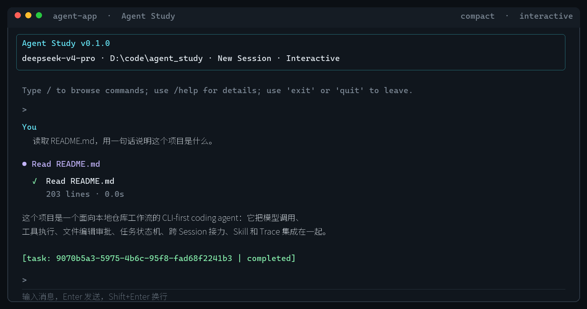

# Agent Study

一个面向本地仓库工作流的 CLI-first coding agent。项目把模型调用、工具执行、文件编辑审批、任务状态机、跨 Session 接力、可扩展 Skill 和可回放 Trace 放进同一个可测试的 Python 实现中，用来研究“本地 coding agent 怎样可靠地完成工作”。

它不是桌面端或 Web 控制台：核心交互是基于 PowerShell 的终端 REPL，状态落在工作区的 SQLite 数据库，单轮命令则保持机器可读的 JSON 输出。

## 界面展示

Compact 模式默认只展示工具摘要和执行统计，完整过程仍可通过 `/trace` 回放：



## 快速开始

```powershell
# 1. 安装
python -m pip install -e .[dev]

# 2. 配置模型
New-Item -ItemType Directory -Force .agent_app | Out-Null
Copy-Item .env.example .agent_app\.env.local
# 编辑 .agent_app/.env.local，填入 MODEL_BASE_URL、MODEL_API_KEY、MODEL_NAME

# 3. 进入交互式 REPL，或执行一次性任务
agent-app
agent-app "src/agent_app/state/ 目录下有哪些文件，各自负责什么"
```

项目兼容 **OpenAI Chat Completions 协议**；任何实现 `/v1/chat/completions` 的模型提供方均可接入，例如阿里云百炼、OpenAI、DeepSeek、Ollama 等。配置细节见 `.env.example`。

首次希望在任意项目目录使用时，执行一次全局配置向导：

```powershell
agent-app --configure
```

它把模型地址、API Key 和模型名写入 `%USERPROFILE%\.agent-study\config.toml`，不会显示 API Key。配置优先级是：环境变量 → 当前项目 `.agent_app\.env.local` → 用户全局 `config.toml` → 内置默认值。无论从哪里启动，当前目录仍是工作空间；每个工作空间仍分别保存自己的 `.agent_app\agent.db`。

## 核心亮点

**持久化 TaskState 与 checkpoint** — 每个目标都有独立生命周期（`created → running → waiting_user/paused → completed/failed/cancelled`，以及安全接力后的 `handed_off`）。一个 Task 下维护多个有边界的 `ExecutionRun`，Planner 请求、模型决策、工具执行、观察和暂停边界都会写入 SQLite checkpoint；达到单窗口轮数上限时暂停并可用 `/continue` 从原 Task 的最新游标继续。Planner 的网络 `request_error` 最多重试 2 次，使用 0.5s、1.0s 的指数退避，并记录每次尝试和安全错误详情。状态迁移、任务事件和 Trace 均使用 SQLite 事务与乐观锁持久化；文件编辑审批可跨进程恢复，重启后的待审批 Shell 命令会失效而不是被静默执行。

**CLI-first 交互体验** — REPL 启动时显示模型、工作区和 Session。Compact 模式持续追加人类可读的工具摘要、耗时和结果统计，默认缓存 stdout/stderr，完整过程可通过 `/trace` 回放；`--verbose` 或 `/verbose` 可切换到详细实时输出。空提示符输入 `/` 会打开带简短说明的单列命令菜单，支持方向键和 Enter；一次性命令不打印 Banner，避免破坏脚本、评测和自动化。

**跨 Session 进度与接力** — `/sessions`（`/progress` 别名）在终端直接浏览最近 Session 的任务、未完成计划、todo、摘要和等待项。`/handoff` 可把安全 checkpoint 接力到新 Session，只复制目标、剩余计划、摘要、证据引用和哈希校验后的 active Skill，不复制原始历史或待审批动作。

**结构化跨 Session Memory** — 成功任务摘要会以 `memory_records` 结构化写入 SQLite，保留 Session/Task 归属、来源引用、标签和重要性；新回合只按字面关键词匹配历史记录，并通过 `/memory [keyword]` 查看。这里不使用 Embedding、向量数据库、向量相似度或 RAG。

**分层、只读的 Skill 机制** — 同时发现项目共享 `skills/<name>/SKILL.md` 与用户全局 `%USERPROFILE%\.agent-study\skills/<name>/SKILL.md`；项目同名 Skill 优先。模型先看到受限的元数据索引，匹配后才加载 `SKILL.md`，再按需读取被正文显式引用的小型支持文件。每次激活固定来源路径、版本和内容哈希，文件变化不会被静默注入。

**安全的 `/learn` 沉淀流程** — 用户显式执行 `/learn project` 或 `/learn user` 后，模型从当前 **agent-app Session** 提炼可复用的 Skill 草稿并写入 SQLite，先展示新增文件 diff。只有再次执行 `/learn save <id>` 才创建新的 Skill 文件夹；不支持覆盖、更新或删除已有 Skill，并拦截疑似凭据的草稿。

**工具安全与崩溃恢复** — Shell 默认逐条审批，可在当前 Session 内授权明确命令前缀；递归/批量删除硬拒绝。文件编辑和受控 Shell 变更在执行前持久化 `ToolAction` 与幂等键；副作用不确定时不会自动重试。

**结构化观察、预算与 Trace** — 超时、冲突、拒绝、权限错误等统一为 `Observation`。模型调用、工具调用、token、活跃时间、重试和重复决策均受预算限制；`/trace`、`--task-trace` 和 `--watch-trace` 让一次任务的决策和执行过程可回放。

**只读审计与 Dry Replay** — `--task-replay TASK_ID --replay-mode audit` 检查事件顺序、工具调用和副作用 `ToolAction` 是否一致；`--replay-mode dry` 只按持久化事件生成“会跳过哪些执行”的报告，不调用模型、不执行工具、不改变 SQLite。Live rerun 不属于默认回放能力，恢复必须走显式 `/resume`（或 `/continue`）、人工副作用收敛和重新审批路径。

**受控子代理与外部研究** — Root agent 只在边界清晰时通过 `delegate_task` 创建 worker Session，并限制深度与每回合数量。用户明确要求查阅公开资料时会触发 `web_search` 预研，来源 URL 随结果进入上下文。

**评测闭环** — 固定 eval 任务覆盖文件编辑、Shell 边界和预算控制；支持 dry-run 与 live-model，保留工作区快照并输出 JSONL 报告。

## 架构地图

```text
用户 / 脚本
    │
    ├─ 单轮：agent-app "任务" ───────────────► JSON 结果
    └─ 交互：agent-app ─► CLI REPL
                              │
                              ├─ /sessions、/memory、/trace、/handoff
                              ├─ /skills、/skill、/learn
                              └─ AgentLoop
                                   │
                    ┌──────────────┼──────────────┐
                    │              │              │
             context_builder   model_client   ToolRegistry
          (summary/todo/       (OpenAI 兼容)  (文件、Shell、
           evidence/Skill)                     todo、搜索、委派、Skill)
                    │              │              │
                    └──────────────┴──────┬───────┘
                                           │
                              SessionService / TaskRuntime
                                           │
                         .agent_app/agent.db (SQLite)
                         sessions · tasks · execution_runs · checkpoints · events · traces · actions · memory_records · Skill activations · drafts
```

主要目录：

```text
src/agent_app/
├── cli.py                    REPL、命令菜单、/sessions、/memory、/learn、Banner
├── orchestrator/
│   ├── loop.py               ReAct 主循环与 active Skill 上下文注入
│   ├── context_builder.py    summary、todo、evidence、Memory、Skill 上下文组装
│   └── subagent_runner.py    受限 worker 子代理执行
├── skills/
│   ├── registry.py           双来源发现、前置元数据、哈希和新建校验
│   └── learning.py           /learn 的会话提炼、脱敏和草稿校验
├── state/
│   ├── db.py                 SQLite schema 与迁移
│   └── session_service.py    Session、Task、Trace、Memory、Skill 激活和草稿持久化
├── runtime/task_runtime.py   TaskState 状态机与转移规则
├── tools/
│   ├── skill.py              skill_list / skill_load / skill_read_resource
│   └── ...                   文件、Shell、搜索、todo、委派等工具
└── agent/definition.py       Root / worker 角色、规则和可用工具
```

## 日常使用

```powershell
agent-app                              # 进入交互式 REPL
agent-app "帮我分析项目结构"             # 单轮执行
agent-app "hello" --new-session        # 不复用最近 Session
agent-app --task-trace TASK_ID          # 查看持久化任务时间线
```

### REPL 命令

| 命令 | 说明 |
|---|---|
| `/task` / `/tasks` | 查看当前 Session 的最新任务或全部任务 |
| `/sessions [count]` | 浏览最近 1–20 个 Session 的进度、todo、摘要和等待项 |
| `/progress [count]` | `/sessions` 的别名 |
| `/memory [keyword]` | 浏览结构化任务记忆，或用字面关键词搜索历史记录 |
| `/trace [task-id前缀]` | 查看任务执行时间线 |
| `/approve` / `/reject` | 批准或拒绝等待审批的工具动作 |
| `/cancel [task-id前缀]` | 取消非终态任务 |
| `/pause` / `/resume` / `/continue` | 暂停或从最新 checkpoint 恢复任务 |
| `/resolve-action [--all]` | 列出或用人工证据收敛中断节点的不确定副作用；`--all` 跨 Session 搜索，全部动作决议后再执行 `/resume` |
| `/handoff [task-id前缀]` | 从安全 checkpoint 创建新 Session 接力任务 |
| `/skills` | 列出有效的项目与用户全局 Skill |
| `/skill <name>` / `/skill:<name>` | 为下一次任务回合显式选择 Skill |
| `/verbose` | 切换 Compact / Verbose 实时输出 |
| `/learn project` | 从当前 agent-app Session 生成项目共享 Skill 草稿 |
| `/learn user` | 生成仅当前用户可复用的全局 Skill 草稿 |
| `/learn drafts` | 列出当前 Session 尚未保存的 Skill 草稿 |
| `/learn save [id]` | 确认创建一个已预览的全新 Skill |
| `/new` | 新建 Session |
| `/help` | 显示命令帮助 |
| `exit` / `quit` | 退出 REPL |

交互式 TTY 会自动启用语义化 CLI 渲染：用户输入、Agent 规划、工具计划、工具执行、审批、成功和失败使用不同颜色，并配合图标、缩进和标签区分。最终回答会单独显示为 `Result` 区块，下面另行显示 `Execution` 状态；当前普通 CLI 尚未接入独立目标验证，因此成功回答会标记为 `Result · unverified`。可用 `--color` 强制启用颜色，或用 `--no-color` 关闭颜色；重定向到管道或测试捕获时默认保留纯文本行式输出，不向 JSON 或脚本输出混入 ANSI 控制序列。

### 跨进程任务控制

```powershell
agent-app --task-status TASK_ID       # 查看 task 状态
agent-app --continue-task TASK_ID     # 从最新 checkpoint 继续任务
agent-app --task-trace TASK_ID        # 渲染时间线
agent-app --task-trace-json TASK_ID   # 导出结构化 Trace
agent-app --watch-trace               # 跟随当前活跃/最新任务
agent-app --task-replay TASK_ID --replay-mode audit  # 只读审计 Trace
agent-app --task-replay TASK_ID --replay-mode dry    # 无副作用 Dry Replay
agent-app --watch-trace TASK_ID       # 跟随指定任务
agent-app --approve-task TASK_ID      # 批准
agent-app --reject-task TASK_ID       # 拒绝
agent-app --cancel-task TASK_ID       # 取消
agent-app --resolve-tool-action ACTION_ID --resolution failed `
  --resolution-reason "原内容仍存在" --resolution-evidence "src/module.py sha256:before"
```

### ReAct 与 Plan-and-Execute

两者是请求入口处互斥的执行模式：路由器会选择 ReAct 或 Plan-and-Execute，不会在 Planner 请求失败时静默切换到另一条分支。Plan-and-Execute 是外层的 DAG 编排；每个计划节点仍通过受限的 `AgentLoop` 执行，因此节点内部使用的是 ReAct 式的“模型决策 → 工具 → Observation”循环。也就是说，Plan-and-Execute 包含多个有边界的 ReAct 节点执行窗口，但不是 Planner 和 ReAct 在同一层互相兜底。

## Skill 使用方式

Skill 的最小单位是一个文件夹，即使初版只包含 `SKILL.md`：

```text
skills/
  review-change/
    SKILL.md
```

`SKILL.md` 必须有简单 YAML frontmatter，至少包含与文件夹同名的 `name` 和用于意图匹配的 `description`。`description` 是模型在索引阶段判断“什么时候该加载此 Skill”的关键信号。

```markdown
---
name: review-change
description: Review a code change for correctness, tests, and regressions.
version: 1
invocation: code review, review a diff
---

1. Inspect the relevant diff and tests first.
2. Report findings with file and line evidence.
3. Do not change files unless the user asks for a fix.
```

MCP 作为可选外部工具适配层接入，但不允许模型自动安装或启用未知 Server；也不允许模型自动下载、修改或删除 Skill。`/learn` 是 Skill 写入入口，且必须经过“草稿预览 → 用户显式 save → 仅新建”的流程。

## 测试

```powershell
python -m unittest discover -s tests -v
python -m coverage run -m unittest discover -s tests -v
python -m coverage report --precision=2
```

项目使用 `unittest`；覆盖率作为观察指标，质量判断以行为回归、安全边界、Eval 和报告完整性为主。

## 设计边界

- 本地 CLI harness，不做服务化、Web UI 或托管运行
- ReAct 循环由项目内 `AgentLoop` 实现，不引入 LangChain/LangGraph 等外部编排框架
- 文件类工具的路径约束在工作区内；Shell 以工作区为启动目录、按当前用户权限执行且默认审批
- `replace_in_file` 不是通用 patch 系统，不支持模糊匹配、正则或多文件编辑
- `waiting_tool` 保留状态契约，但工具仍是同步执行
- Skill 当前不等于插件或 MCP：只提供有边界、可审计的本地指令加载；不支持更新/删除已有 Skill
- 上下文以 summary、todo、recent tool evidence、结构化 Memory、Skill 索引和 active Skill 为主；Memory 只做字面关键词匹配，不做 Embedding、向量相似度或 RAG
- 不设 RBAC、租户、告警等服务化 governance 机制

## 延伸文档

- [完整架构地图](docs/ARCHITECTURE.md)
- [Skill 设计与 `/learn` 说明](docs/SKILLS.md)
- [跨 Session 进度命令](docs/SESSIONS.md)
- [TaskState 状态机](docs/TASK_STATE_MACHINE.md)
- [路线图](docs/ROADMAP.md)
- [Eval 使用指南](docs/EVAL_DEMO.md)
