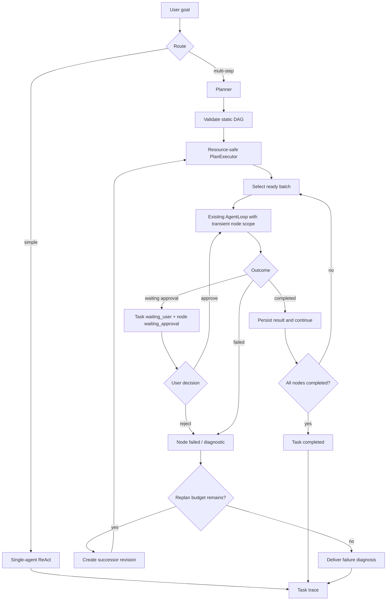

# Plan-and-Execute

AgentLab keeps simple, exploratory, and clarification requests on the existing
single-agent ReAct path. Explicit `/plan-and-execute` always selects planning.
Automatic routing is conservative: one sequence word, a normal question, or a
line break is not enough. It requires a structured action list, an ordered
multi-action sequence, or a code-change plus verification pair.

## Current contract

- The Planner returns a validated, static acyclic `PlanGraph`.
- The first node kinds are intentionally limited to `inspect`, `edit`, `run`,
  and `verify`.
- Each node declares `objective`, `acceptance`, `depends_on`, and an allowed
  tool subset. The subset can be narrower than the kind default, never wider.
- The executor computes ready nodes from dependency state, then selects a
  deterministic resource-safe batch under a concurrency limit. Nodes may
  declare `ResourceClaim` entries with `read`, `write`, or `exclusive` access;
  missing claims use conservative defaults (`inspect` reads `workspace`, while
  `edit`, `run`, and `verify` exclusively claim `workspace`). There is no fixed
  node-count limit, conditional branch, loop, or recursive subgraph.
- The generic `NodeRunner` boundary supports concurrent batches. The current
  `PlanAgentNodeRunner` explicitly opts out because one shared AgentLoop still
  owns mutable turn state and one optimistic TaskRuntime version stream; the
  integrated AgentLoop path therefore remains serial until Worker/Task
  isolation is implemented.
- A node reuses the existing `AgentLoop` with a transient node prompt. The
  prompt is visible to the model for that turn but is not persisted as a user
  message. The node's tool subset and `keep_task_open` boundary are passed to
  the loop.
- A side-effect tool can pause the node at `waiting_approval`. The approval
  command resumes that same node scope; successful approval advances the node
  and the executor continues with its dependents.
- A node may call `ask_user` for missing information. A natural-language
  answer resumes the same node with the same scope; `/approve` and `/reject`
  are reserved for `tool_approval` and do not answer an `ask_user` question.
- A failed node keeps the active revision available while the Service may ask
  for a successor revision. Completed nodes and their evidence are preserved.
  Replanning is bounded by the task budget (`max_replans`, currently 2).
- If automatic Replan itself fails, the Service records the Planner/Revision
  error and closes both the Task and active PlanRevision as failed.
- Recovery inspection is read-only and derives a `RecoveryDecision` from the
  persisted Task, active revision, node, pending action, ToolAction, and lease
  facts. An expired running node with a possible write side effect cannot be
  rewound automatically.
- An operator can attach one immutable resolution to each unresolved ToolAction
  of the current interrupted node. Recovery groups duplicate attempts by tool
  name and normalized arguments, then derives one decision from the complete
  history: all distinct effects absent permits a node retry; all distinct
  effects present completes the node without replay; mixed present/absent
  effects remain blocked for manual repair. Any unresolved action also blocks.

## Execution and audit flow



The important state transitions are persisted in SQLite task traces:

| Trace type | Meaning |
| --- | --- |
| `plan_created` | Initial revision and node contracts were persisted. |
| `plan_node_transition` | A node changed status, with its kind, objective, acceptance, and bounded result preview. |
| `plan_node_approval` | A user approval decision moved a waiting node to its next state. |
| `plan_node_user_message` | A natural-language answer resumed an `ask_user` node. |
| `plan_execution` | One executor invocation ended with completed, waiting, blocked, or failed status. |
| `plan_failure` | Failed and skipped nodes plus a diagnosis reason. |
| `plan_replan` | Old and successor revisions, reason, and preserved completed nodes. |
| `plan_replan_failed` | Automatic Replan failed; the Task and active revision were closed. |
| `tool_action_resolution` | A human attached an immutable outcome, reason, evidence, identity, and timestamp to an unresolved side effect. |
| `plan_recovery_rewind` | A confirmed absent effect allowed an interrupted node to return to pending before retry. |
| `plan_recovery_accept_effect` | A confirmed completed effect advanced the interrupted node without replaying it. |

`/trace` and `--task-trace-json` expose these events together with the normal
AgentLoop model/tool traces, so a Plan run can be replayed without treating the
PlanGraph as a separate hidden subsystem.

Use `/resolve-action` to list candidates in the current Session, or
`/resolve-action --all` to search across Sessions. Resolve every candidate for
the interrupted node with concrete evidence and then explicitly resume the Task:

```text
/resolve-action <action-id-prefix> failed "Original hash still present" -- src/module.py sha256:before
/resume <task-id-prefix>
```

The non-interactive equivalent requires the full action ID plus
`--resolution`, `--resolution-reason`, and `--resolution-evidence`.

## Acceptance checklist

The current implementation is accepted when all of the following hold:

1. A valid graph executes in dependency order and persists every node result.
2. The model receives the node objective and acceptance criteria while the
   session transcript remains free of the transient prompt.
3. A pending approval pauses the task and, after approval, resumes only the
   original node's allowed tools before continuing downstream nodes.
4. An `ask_user` node resumes from a natural-language answer, retains its
   node scope, and can ask a second question without leaving the Plan.
5. A failed node produces a failure trace; an available budget creates a new
   revision without deleting completed evidence; exhausted budget produces a
   terminal diagnosis.
6. A failed automatic Replan produces a terminal Task and failed revision,
   rather than leaking an active broken revision.
7. The targeted Plan, trace, and existing AgentLoop tests pass. Full-suite
   failures must be reported separately when they are unrelated baseline
   drift.
8. An interrupted write remains blocked until its ToolAction is resolved;
   all confirmed-absent effects may be retried, all confirmed-present effects
   advance the node without a second tool execution, and mixed effects remain
   blocked rather than selecting the latest resolution.

## Deliberately deferred

MCP, vector databases, code RAG, multiple agents, multiple processes editing
one workspace, and end-to-end parallel AgentLoop node execution remain later
capabilities. The scheduler's generic resource-safe batch boundary is already
implemented, but it is not implied that the current shared-task AgentLoop
adapter executes those batches concurrently. None of this roadmap introduces
RAG, Embedding, vector similarity, or a vector database.
