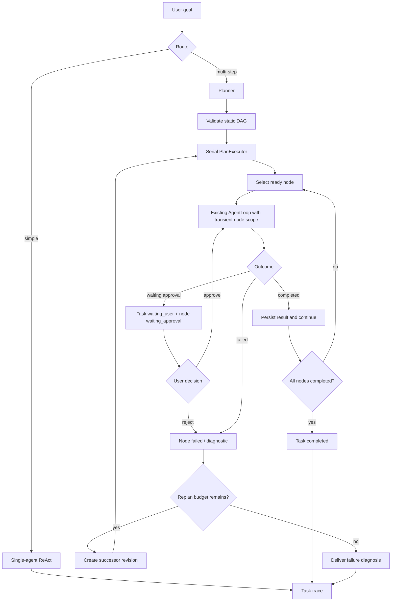

# Plan-and-Execute

AgentLab keeps simple coding requests on the existing single-agent ReAct path.
Requests with explicit multi-step intent can enter Plan-and-Execute through
`/plan-and-execute` or the router's multi-step markers.

## Current contract

- The Planner returns a validated, static acyclic `PlanGraph`.
- The first node kinds are intentionally limited to `inspect`, `edit`, `run`,
  and `verify`.
- Each node declares `objective`, `acceptance`, `depends_on`, and an allowed
  tool subset. The subset can be narrower than the kind default, never wider.
- Nodes execute serially in dependency order. There is no fixed node-count
  limit, conditional branch, loop, recursive subgraph, or shared-workspace
  parallel execution.
- A node reuses the existing `AgentLoop` with a transient node prompt. The
  prompt is visible to the model for that turn but is not persisted as a user
  message. The node's tool subset and `keep_task_open` boundary are passed to
  the loop.
- A side-effect tool can pause the node at `waiting_approval`. The approval
  command resumes that same node scope; successful approval advances the node
  and the executor continues with its dependents.
- A node may call `ask_user` for missing information. A natural-language
  answer resumes the same node with the same scope; `/approve` and `/reject`
  are reserved for `tool_approval` and do not answer an `ask_user` question.
- A failed node keeps the active revision available while the Service may ask
  for a successor revision. Completed nodes and their evidence are preserved.
  Replanning is bounded by the task budget (`max_replans`, currently 2).
- If automatic Replan itself fails, the Service records the Planner/Revision
  error and closes both the Task and active PlanRevision as failed.
- Recovery inspection is read-only and derives a `RecoveryDecision` from the
  persisted Task, active revision, node, pending action, ToolAction, and lease
  facts. An expired running node with a possible write side effect cannot be
  rewound automatically.
- An operator can attach one immutable resolution to the current interrupted
  node's unresolved ToolAction. `failed` means the intended effect is confirmed
  absent and explicit resume may retry the node. `succeeded` means the intended
  effect is confirmed present; explicit resume completes that node from the
  supplied evidence without replaying its tool call.

## Execution and audit flow



The important state transitions are persisted in SQLite task traces:

| Trace type | Meaning |
| --- | --- |
| `plan_created` | Initial revision and node contracts were persisted. |
| `plan_node_transition` | A node changed status, with its kind, objective, acceptance, and bounded result preview. |
| `plan_node_approval` | A user approval decision moved a waiting node to its next state. |
| `plan_node_user_message` | A natural-language answer resumed an `ask_user` node. |
| `plan_execution` | One executor invocation ended with completed, waiting, blocked, or failed status. |
| `plan_failure` | Failed and skipped nodes plus a diagnosis reason. |
| `plan_replan` | Old and successor revisions, reason, and preserved completed nodes. |
| `plan_replan_failed` | Automatic Replan failed; the Task and active revision were closed. |
| `tool_action_resolution` | A human attached an immutable outcome, reason, evidence, identity, and timestamp to an unresolved side effect. |
| `plan_recovery_rewind` | A confirmed absent effect allowed an interrupted node to return to pending before retry. |
| `plan_recovery_accept_effect` | A confirmed completed effect advanced the interrupted node without replaying it. |

`/trace` and `--task-trace-json` expose these events together with the normal
AgentLoop model/tool traces, so a Plan run can be replayed without treating the
PlanGraph as a separate hidden subsystem.

Use `/resolve-action` to list candidates in the current Session. Resolve one
with concrete evidence and then explicitly resume the Task:

```text
/resolve-action <action-id-prefix> failed "Original hash still present" -- src/module.py sha256:before
/resume <task-id-prefix>
```

The non-interactive equivalent requires the full action ID plus
`--resolution`, `--resolution-reason`, and `--resolution-evidence`.

## Acceptance checklist

The current implementation is accepted when all of the following hold:

1. A valid graph executes in dependency order and persists every node result.
2. The model receives the node objective and acceptance criteria while the
   session transcript remains free of the transient prompt.
3. A pending approval pauses the task and, after approval, resumes only the
   original node's allowed tools before continuing downstream nodes.
4. An `ask_user` node resumes from a natural-language answer, retains its
   node scope, and can ask a second question without leaving the Plan.
5. A failed node produces a failure trace; an available budget creates a new
   revision without deleting completed evidence; exhausted budget produces a
   terminal diagnosis.
6. A failed automatic Replan produces a terminal Task and failed revision,
   rather than leaking an active broken revision.
7. The targeted Plan, trace, and existing AgentLoop tests pass. Full-suite
   failures must be reported separately when they are unrelated baseline
   drift.
8. An interrupted write remains blocked until its ToolAction is resolved;
   confirmed absent effects may be retried, while confirmed completed effects
   advance the node without a second tool execution.

## Deliberately deferred

MCP, vector databases, code RAG, multiple agents, multiple processes editing
one workspace, and true parallel DAG scheduling remain later capabilities. They
are not implied by the current Plan-and-Execute trace or by the `delegate_task`
tool outside PlanGraph execution.
