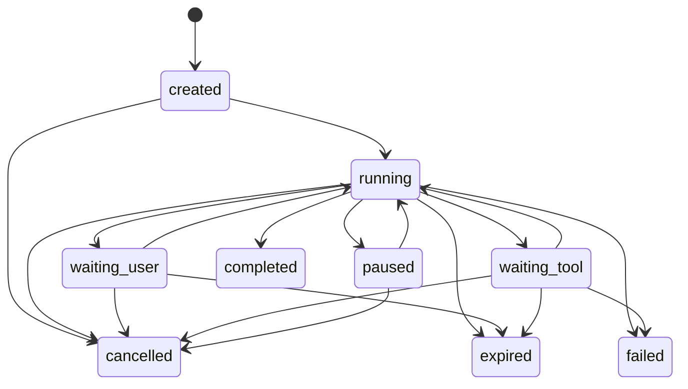

# TaskState 状态机架构

## 定位

项目继续使用现有 OpenAI-compatible function calling ReAct loop，但把一次
用户目标从“单次 `run_turn()` 的隐式状态”提升为可持久化、可恢复、可审计的
Task。Session 负责对话连续性，Task 负责一个目标的执行生命周期。

Planner、Critic 和 Reflection 只是条件触发的轻量辅助。Governance 平台、
RBAC、租户、告警与外部指标不在当前范围。

## 状态机



`completed`、`failed`、`cancelled` 和 `expired` 是不可变终态。`waiting_tool`
只预留契约，本期不实现异步工具轮询。

同一 Session 中：

- `waiting_user` 后的输入恢复原 Task。
- 终态后的新目标创建新 Task。
- 非法迁移抛出 `InvalidTaskTransition`。
- Event 使用 `expected_version` 做乐观锁，事件、快照、预算和迁移 Trace
  在同一 SQLite 事务提交。

## 核心数据

`TaskState` 保存：

- goal、status、step、Task Plan 和 working memory
- PendingAction、最后 Observation 和 Reflection 摘要
- TaskBudget 使用量与上限
- stop_reason、version、waiting deadline 和时间戳

`AgentEvent` 统一保存：

```text
id, task_id, session_id, type, source, payload,
correlation_id, causation_id, sequence, created_at, expected_version
```

SQLite 使用三组任务表：

- `tasks`：当前 Task 快照
- `task_events`：append-only 事件日志
- `task_traces`：模型、决策、审批、工具、预算和状态迁移记录

## 运行入口

新入口是 `AgentRuntime.handle_event(event)`；兼容入口
`AgentLoop.run_turn(user_input, session_id)` 保留，并在内部创建或恢复 Task。

`TurnResult` 保留原字段，同时追加：

- `task_id`
- `task_status`
- `pending_action`

CLI 支持 `--task-status`、`--pause-task`、`--resume-task`、`--cancel-task`、
`--approve-task` 和 `--reject-task`。

## ReAct 与 Observe

Policy 仍由模型 function calling 驱动，动作包括普通 `tool_call` 以及控制动作
`ask_user`、`final_answer`、`give_up`。

Executor 负责：

1. 参数校验和静态审批策略。
2. 需要人工批准时持久化 PendingAction。
3. 在执行前写入 ToolAction，并维护 attempt、retry_of 和幂等键。
4. 捕获所有 `tool.execute()` 异常。
5. 把结果转换为结构化 Observation。

Observation 包含：

```text
status, error_type, message, retryable, side_effect,
raw_data, evidence_ref, attempt, duration_ms
```

标准错误语义包括 timeout、transient、invalid_arguments、
permission_denied、not_found、conflict、user_denied、unsafe_action、
runtime_error 和 uncertain_side_effect。

只读或明确幂等的瞬时失败最多重试两次；有副作用且非幂等的动作不自动重试。
跨进程批准文件编辑时，Executor 会比较批准时与执行时的路径和前后内容哈希，
避免批准后文件变化造成覆盖。

## 预算与终止

默认硬预算：

| 项目 | 上限 |
| --- | ---: |
| 模型调用 | 24 |
| 工具调用 | 24 |
| 总 token | 120,000 |
| 活跃执行时间 | 900 秒 |
| `waiting_user` 有效期 | 24 小时 |
| 安全动作自动重试 | 2 次 |
| 相同决策连续出现 | 3 次 |
| Reflection 后重规划 | 1 次 |

任务终止原因以结构化字符串持久化，包括正常完成、主动放弃、取消、等待过期、
模型错误、预算耗尽、重复决策、连续失败、无效响应、不确定副作用、Trace
持久化错误和内部异常。

## 轻量推理

- Planner：仅在新建多步骤 Task 或已有 Task Plan 需要继续时记录触发，不替代
  ReAct Policy。
- Critic：以确定性规则保护副作用动作，并在最终答案阶段记录证据情况。
- Reflection：重试耗尽、连续失败或重复决策时最多触发一次，并占用重规划预算。

三者都不是独立模型流水线，也没有各自的常驻状态机。

## Trace

Task Trace 立即记录：

- Model：phase、model、duration、input/output/total token、usage source、error
- Decision：动作类型、工具名和参数
- Approval：pending/approve/reject、风险和恢复来源
- Tool：参数、参数哈希、attempt、retry_of、耗时、错误语义和副作用
- Observation：status、error_type、retryable、evidence 和 duration
- Budget：完整预算快照
- State：from/to、event、reason、version 和预算快照

provider 不返回 usage 时使用估算值，并标记 `usage_source=estimated`。核心 Trace
写入失败会使 Task 以 `trace_persistence_error` 失败，不再静默吞掉。

## 验证

```powershell
python -m unittest discover -s tests
python -m coverage run -m unittest discover -s tests
python -m coverage report --precision=2 --fail-under=90
```

状态机、Event 顺序、版本冲突、事务回滚、跨进程审批、安全重试、异常边界、
预算、Trace 完整性、旧 SQLite 升级和 API/CLI 兼容均有自动化测试。
